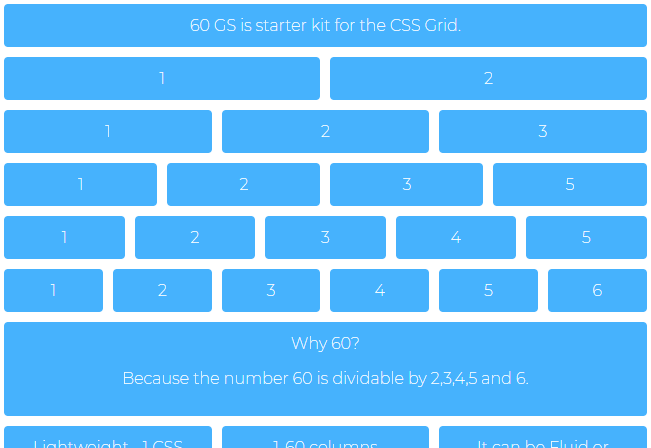

# sultan_abdullah-HW#4-responsive-prototype
 Building a mobile first responsive web page prototype using the CSS grid

## Installation

git clone https://github.com/therealsult/sultan_abdullah-HW-4-responsive-prototype.git

## Usage

Creating a resposive prototype using the CSS grid framework. 

## Contributing

1. Fork it!
2. Create your feature branch: `git checkout -b my-new-feature`
3. Commit your changes: `git commit -am 'Add some feature'`
4. Push to the branch: `git push origin my-new-feature`
5. Submit a pull request :D

## Credits

therealsult 
Ghirmay-S

Project link: https://github.com/therealsult/sultan_abdullah-HW-4-responsive-prototype

## License

Distributed under the MIT License.